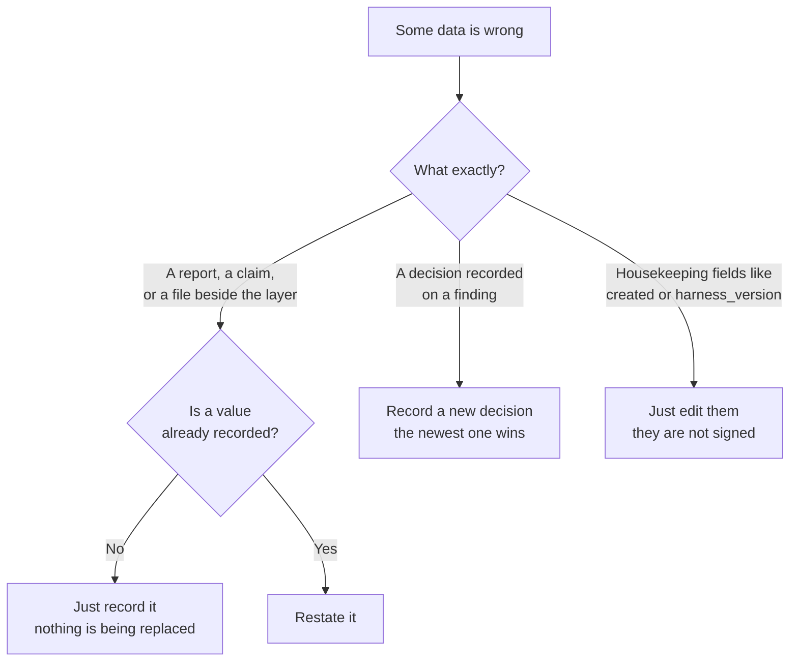

# Restatement

Fixing data the ledger already signed — without erasing what it said before.

## Why this exists

Sometimes a signed layer points at the wrong thing. A report gets reissued. A
finding's claim is revised and re-baselined. A file beside the layer is repaired
because it failed validation. In every case a digest recorded in the layer has
to change.

Before restatement, the only way to do that was to overwrite the digest and
re-sign. That worked, but it threw away the old value, who changed it, and why —
so afterwards an approved fix looked exactly like tampering. Verification could
only say "this doesn't match; ask a human."

A restatement records the change instead of hiding it. The old value, your
identity, and a ticket are appended to the layer's history, and the layer is
re-signed. Next time anyone verifies it, the change is explained.

## Do I need one?



**Use a restatement when a value that is already recorded, and covered by the
signature, has to change.** That's the whole trigger.

## What you can restate

| Field | When |
|---|---|
| `audit_report_sha256` | the report the layer annotates was reissued or re-audited |
| `claim_hashes` | a finding's claim was revised, and re-baselined |
| `artifact_digests` | a file beside the layer was repaired |

You can only *replace* a value this way. Recording something for the first time
isn't a restatement — nothing is being replaced, so it needs no ticket and no
admin rights.

## Who can restate

A restatement is always authored by a verified human: a service account or other
machine identity is refused on every entry point.

*Which* humans may restate is decided by the REST service, which checks the
caller against `LAAS_ADMIN_IDENTITIES` (and `LAAS_RESTATEMENT_MIN_APPROVERS`).
Those settings belong to whoever runs the service, and callers can't change
them.

`ledger restate` and `LedgerClient.restate()` don't check the admin list. A
local caller sets its own environment and holds the storage credentials, so a
list it reads for itself would stop no one. What they do instead is record who
restated, the ticket, and the rationale, inside the signed history. To restrict
who may restate, route writes through the REST service and don't hand storage
credentials to the people or pods you want to restrict.

## What you can't, and what to do instead

| You want to… | Why not | Instead |
|---|---|---|
| Change a decision on a finding (severity, validity, rationale) | the history is append-only; nothing recorded is ever edited | record a new decision — the newest one wins |
| Remove a past entry | same | record the decision that replaces it |
| Fix a rename between audits | renames already have their own kind of entry | record a rebaseline |
| Fix housekeeping fields (`created`, `harness_version`, `repository`) | they aren't covered by the signature, so nothing is lost by editing them | edit them normally |
| Fix a finding's wording in the audit report | the report isn't the ledger | fix the report, mark the finding `corrected`, re-baseline it, then restate `claim_hashes` |

## Doing it

You supply the entries as they stand now (`--before`) and what they should be
(`--after`) — only the entries that change, not the whole set.

```bash
ledger restate \
  --layer acme-widget \
  --target claim_hashes \
  --reason data_error \
  --before '{"FIND-001": "1baa…"}' \
  --after  '{"FIND-001": "3dbb…"}' \
  --ticket SEC-4002 \
  --rationale "Severity was wrong in the baseline; re-baselined after the report was fixed."
```

Several at once, from a file:

```bash
ledger restate --from repairs.json
```

Each entry in the file is checked on its own, and each layer is written on its
own. If one is rejected, the rest still go through and you get a report of what
applied and what didn't.

You can do the same thing from Python or over HTTP:

| | One layer | Several |
|---|---|---|
| Command line | `ledger restate --layer …` | `ledger restate --from repairs.json` |
| Python | `client.restate(...)` | `client.restate_many([...])` |
| HTTP API | `POST /v1/ledger/layers/{id}/restate` | send one request per layer |

All three run the same checks. There's no bulk HTTP endpoint on purpose — layers
are written one at a time, so a single request covering many of them couldn't
succeed or fail as a unit, and it would be misleading to pretend otherwise.

## Why it might be rejected

Nothing is written unless every check passes, so a rejected restatement leaves
the layer exactly as it was.

| Rejected because | What it means |
|---|---|
| You're not an administrator (REST) | the service limits restatements to a configured list of people. An empty list means nobody. |
| Not enough approvers (REST) | the service requires other people named in `approved_by` |
| Not a verified human | restatements record a human decision; machine and unverified identities can't author one |
| No ticket | a restatement has to say what authorised it |
| Nothing actually changed | `before` and `after` are the same |
| Nothing to replace | that value was never recorded — just record it normally |
| Someone changed it first | `before` no longer matches what's stored. Re-read and try again. |
| Going back to an old value | see below |
| Rationale too short | the rationale is the record of *why*; it has to say something |

### You can't go backwards

A restatement can't return a value to something it was already moved away from.
Undoing an earlier restatement is its own decision and deserves its own reason,
rather than arriving as a silent rollback. Moving forward to a new value is
always fine.

This also keeps the history from being padded — without the rule, someone could
flip a value back and forth indefinitely, growing the layer every time.

## What verification sees afterwards

Each restated entry is expected to still hold the value its most recent
restatement gave it. Entries nobody restated are left alone. If a restated entry
no longer matches, verification reports it — meaning either the layer was edited
outside the ledger, or a restatement was deleted while its effect was left
behind.

Signatures need no special handling. A restatement is an ordinary addition to
the layer's history, so the layer is re-signed as part of the same write.

## Settings

| Setting | Default | What it controls |
|---|---|---|
| `LAAS_ADMIN_IDENTITIES` | empty | REST service only: who may restate. Empty means nobody can. |
| `LAAS_RESTATEMENT_MIN_APPROVERS` | `0` | REST service only: how many other people must be named in `approved_by` |
